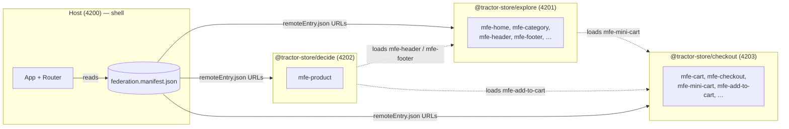

# Tractor Store — Documentation

The Tractor Store is a four-app micro-frontend system: a thin **host** shell
plus three independently-deployed **remotes** owned by separate teams. The
host owns the URL and the page chrome; the remotes ship UI as web components
and link to each other through *intent IDs* instead of hard-coded URLs. All
composition happens at runtime — there is no build-time wiring between apps.

The runtime is [Native Federation v4][nf], the standards-based successor to
webpack Module Federation built on ECMAScript Modules and Import Maps.

[nf]: https://native-federation.com/

## At a glance

The manifest is the only piece of "wiring": every app fetches it at startup
and uses it to find the others. The dotted lines are *cross-remote fragment
loads* — a remote can mount another remote's custom element inside its own
page without going through the host.

## Read next

- **[Architecture](./architecture.md)** — what the host owns vs. what each
  remote owns, how Native Federation discovers remotes at runtime, and the
  custom-element bridge.
- **[Navigation](./navigation.md)** — the intent-based navigation system and
  why it's the load-bearing piece of the decoupling.
- **[Features](./features.md)** — what each team ships, the fragments they
  expose, and the cross-remote dependencies between them.

## Where does X live?

| Concern                               | File / module                                                      |
| ------------------------------------- | ------------------------------------------------------------------ |
| Bootstrap & federation init           | `projects/host/src/main.ts`                                        |
| Host DI providers & Router setup      | `projects/host/src/app/app.config.ts`                              |
| Building routes from contributions    | `projects/host/src/app/nav/setup-shell-nav.ts`, `remote-routes.ts` |
| Loading a remote's custom element     | `projects/host/src/app/loader/slice-loader.ts`, `remote-shell.component.ts` |
| Cross-MFE link directive (`[navLink]`)| `libs/navigation/src/lib/nav-link.directive.ts`                    |
| Intent → URL resolution               | `projects/host/src/app/nav/nav-registry.ts`                        |
| Event bus contract                    | `libs/navigation/src/lib/nav-bus.ts`                               |
| Remote bootstrap (custom-element)     | `projects/<remote>/src/features/<feature>/bootstrap.ts`            |
| Remote nav contribution               | `projects/<remote>/src/core/nav-contribution.ts`                   |
| Federation config (per app)           | `projects/<app>/federation.config.mjs`                             |
| Runtime remote discovery              | `projects/<app>/public/federation.manifest.json`                   |
| Per-environment values                | `projects/<app>/public/env.config.json`                            |
| Team boundary visualisation overlay   | `public/cdn/js/helper.js`                                          |
