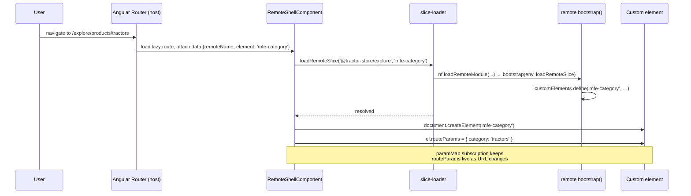

# Architecture

This document explains the contract between the host and the remotes — what
each side owns, where the boundary sits, and how the three decoupling
mechanisms (custom elements, the event bus, shared libraries) make runtime
composition possible without coupling the apps together.

## Why decoupling matters

Three teams ship three Angular applications into one page. The architecture
has one job: keep those teams independent. Independent means a team can
rename a route, swap an internal component, or roll forward a backend
change without coordinating with the other teams.

Whenever two MFEs talk to each other directly — by importing types,
sharing a `Router`, or calling each other's services — they pick up a
hidden dependency that turns "deploy whenever you want" into "deploy
whenever the other team is ready". The architecture below avoids that by
inserting an explicit, stable contract at every place where the apps meet.

## The two-layer model

Two layers, with a small, explicit contract between them.

```mermaid
flowchart LR
    subgraph HostSide["HOST"]
        direction TB
        HA["Owns the URL<br/>(Angular Router)"]
        HB["Owns page chrome<br/>(layout, error UI)"]
        HC["Loads remotes via<br/>Native Federation"]
        HD["Maintains the<br/>NavRegistry"]
    end

    subgraph RemoteSide["REMOTE (×3)"]
        direction TB
        RA["Self-contained<br/>Angular slice"]
        RB["Ships fragments as<br/>mfe-* custom elements"]
        RC["Declares routes via<br/>nav-contribution"]
        RD["Reads route data via<br/>routeParams input"]
    end

    HostSide e1@==>|"federation.manifest.json"| RemoteSide
    HostSide e2@==>|"loads nav-contribution<br/>+ mfe-* elements"| RemoteSide
    RemoteSide e3@-->|"emits navigation:navigate<br/>via __NF_REGISTRY__"| HostSide

    e1@{animate: true}
    e2@{animate: true}
    e3@{animate: true}
```



The contract has exactly four touchpoints:

1. **`federation.manifest.json`** — the host's list of remote names → entry
   URLs, fetched at startup.
2. **`nav-contribution`** — a module each remote *exposes* that declares
   its base path and the intents (routable destinations) it owns.
3. **`mfe-*` custom elements** — the actual UI fragments, also exposed via
   federation. The host instantiates these via `document.createElement`.
4. **`routeParams`** — a single object property the host writes onto a
   mounted custom element, carrying parsed path and query parameters.

Nothing else is shared at the boundary. There is no `import` from a remote
in host code, no Angular service crossing the line, no shared router state.

## The three decoupling mechanisms

### 1. Custom elements as the integration surface

A remote does not ship Angular components for the host to import. It ships
**custom elements** (web components) registered under stable `mfe-*` tags
via `@angular/elements`.

A typical remote feature bootstrap
(`projects/explore/src/features/home/bootstrap.ts`):

```ts
const TAG = 'mfe-home';

export async function bootstrap(env, loadRemoteSlice) {
  const injector = await ensureSharedInjector(env, loadRemoteSlice);
  if (!customElements.get(TAG)) {
    customElements.define(TAG, createCustomElement(HomePage, { injector }));
  }
}
```

The browser's standard custom-element machinery does the integration.
That choice has three consequences worth calling out:

- **Plain HTML is the contract.** A consumer drops `<mfe-cart>` in a
  template; nothing else is required. No Angular type, RxJS Observable, or
  service interface crosses the boundary.
- **One Angular per remote.** `ensureSharedInjector`
  (`projects/explore/src/core/shared-injector.ts`) lazily creates a single
  Angular `Injector` and reuses it for every feature in the same remote.
  When the host mounts `<mfe-home>` and `<mfe-header>` from explore, they
  share `HttpClient`, stores, and other DI-provided services — but nothing
  leaks across remotes.
- **Bootstrap is idempotent.** The `customElements.get` guard plus the
  loader's per-tag `seen` map (`projects/host/src/app/loader/slice-loader.ts`)
  make it safe to request the same fragment from many places. Only the
  first call defines the element; subsequent calls are no-ops.

#### Why a single `routeParams` property and not attributes

`HTMLElement` reserves a long list of property names (`id`, `slot`,
`title`, `hidden`, `style`, …). If the host wrote each route param as its
own attribute or property it would silently collide with intrinsics — set
`<mfe-cart id="abc">` and Angular would happily read `''` because the DOM
already owns `id`. Instead, all params land under one well-known property
(`routeParams`), and the remote reads them through helpers in
`libs/events/src/lib/route-params.ts` (`param`, `requiredParam`,
`paramList`). Clean separation, zero collisions.

#### How a route activation lands a custom element on the page



The host component
(`projects/host/src/app/loader/remote-shell.component.ts`) follows exactly
this script: it reads `{ remoteName, element }` from the route data, calls
the loader, creates the element, and pipes `paramMap` + `queryParamMap`
into a single `routeParams` object. While the slice is loading it shows a
spinner; if the load fails it shows an error message.

### 2. The event bus (`window.__NF_REGISTRY__`)

Custom elements solve composition: a remote can mount another remote's UI.
But composition alone is not enough — the remotes also need to *talk* to
each other. They do that through a tiny shared event bus that the host
sets up before Angular bootstraps.

The bus lives on `window.__NF_REGISTRY__` and is created at the top of
`projects/host/src/main.ts`:

```ts
window.__NF_REGISTRY__ = Object.freeze(createRegistry({
  maxStreams: 10, maxEvents: 10, removePercentage: 0.5,
})());
```

It is a small pub/sub object provided by the Native Federation
orchestrator, with two interesting features:

- `emit(name, data)` / `on(name, handler)` — standard pub/sub.
- `register(name, value)` / `onReady(name, handler)` — a "shared resource"
  variant where late subscribers immediately receive the current value.
  This is how the host advertises the populated `NavRegistry` so that link
  directives in remotes can resolve intents whether they boot before or
  after the host has finished setup.

Three event channels travel on this bus today:

| Channel               | Defined in                                    | Direction          | Purpose                                                       |
| --------------------- | --------------------------------------------- | ------------------ | ------------------------------------------------------------- |
| `navigation:*`        | `libs/events/src/lib/nav-bus.ts`              | remote → host      | Intent-based and URL-based navigation requests                |
| `store:selected`      | `libs/events/src/lib/store-bus.ts`            | explore → checkout | Notify checkout when the user picks a pickup store            |
| `cart:updated`        | `projects/checkout/src/core/data/store/cart-bus.ts` | checkout ↔ checkout | Sync `CartStore` instances loaded from different host slices |

The third channel is worth a closer look: the **checkout** remote's
`CartStore` is an `@Injectable` service, so each slice that the loader
bootstraps gets its own instance. When `mfe-mini-cart` (mounted inside
explore's header) and `mfe-cart` (mounted as a host route) run side by
side, they would otherwise drift. The internal `cart-bus` rides on the
same `__NF_REGISTRY__` to keep both stores in step without any of them
knowing about each other directly.

The pattern generalises: when two MFEs need to coordinate on a piece of
state, define a stable event name, give it a typed payload, and put both
the emitter and listener helpers in one small file. No singleton service,
no shared DI tree, no hidden imports.

### 3. Shared libraries via `sharedMappings`

Every app's `federation.config.mjs` shares Angular and a small set of
internal libraries:

```ts
shared: {
  ...shareAll(
    { singleton: true, strictVersion: true, requiredVersion: 'auto', build: 'package' },
    {
      overrides: {
        '@angular/core': { /* …same flags… */ includeSecondaries: { keepAll: true } },
      },
    },
  ),
},
sharedMappings: ["@internal/events", "@internal/ui", "@internal/logging"],
skip: ['rxjs/ajax', 'rxjs/fetch', 'rxjs/testing', 'rxjs/webSocket'],
```

What the flags mean:

- **`singleton: true` on Angular packages.** Exactly one `@angular/core`
  on the page. Without this, two copies of Angular would each have their
  own `Zone`, their own injector tree roots, and DI would silently break
  across remotes. `strictVersion: true` makes a version mismatch fail
  loudly at load time instead of producing weird runtime bugs.
- **`includeSecondaries: { keepAll: true }` on `@angular/core`.** Keeps
  secondary entry points (`@angular/core/rxjs-interop`, etc.) in the
  shared bundle so remotes can use them without re-bundling them.
- **`sharedMappings`** for the internal libraries. These are TypeScript
  path-mapped libraries inside this workspace; sharing them means the
  host and all remotes use the same `NavLinkDirective`, `Spinner`, etc.
  Critically, `instanceof` checks and singleton state work across the
  boundary — there is exactly one event-bus contract in memory, not three.
- **`skip`** trims rxjs sub-entries that aren't actually used at runtime,
  cutting the shared bundle.

Per-remote configs add an `exposes` map that lists the `mfe-*` modules
and the `nav-contribution` for that team. The host config has no
`exposes` — it only consumes.

A fourth library, `@internal/federation`, lives in `libs/federation/` but
is **not** in `sharedMappings`. It ships `EnvironmentConfig`, the slice
loader factory, and the CDN URL helper — code that runs once at bootstrap
inside each remote's `main.ts`. Bundling it locally avoids load-order
puzzles and keeps `__NF_REGISTRY__` setup in `main.ts` self-sufficient.

## Runtime discovery

The host bootstrap (`projects/host/src/main.ts`) is short and deliberately
manifest-driven:

```ts
window.__NF_REGISTRY__ = Object.freeze(createRegistry({...})());

Promise.all([
  fetch('./env.config.json').then((r) => r.json()),
  fetch('./federation.manifest.json').then((r) => r.json()),
]).then(async ([env, manifest]) => {
  const nf = await initFederation(manifest, {
    ...useShimImportMap({ shimMode: true }),
    hostRemoteEntry: './remoteEntry.json',
    /* … */
  });
  return import('./app/bootstrap').then((m) => m.bootstrap(nf, env, manifest));
});
```

Two artefacts drive everything:

- **`env.config.json`** — per-environment values: `apiUrl`, `cdnUrl`,
  `production`, `scope`. Same shape across all four apps. CI rewrites it
  for the deployed environment, so the same build works locally and on
  GitHub Pages.
- **`federation.manifest.json`** — the discovery file:

  ```json
  {
    "@tractor-store/explore":  "http://localhost:4201/remoteEntry.json",
    "@tractor-store/decide":   "http://localhost:4202/remoteEntry.json",
    "@tractor-store/checkout": "http://localhost:4203/remoteEntry.json"
  }
  ```

  Each value is the URL of a remote's `remoteEntry.json` — the import-map
  fragment Native Federation publishes during build. `initFederation`
  merges all of them into the page's import map so any subsequent
  `nf.loadRemoteModule(remoteName, exposedModule)` resolves to the right
  bundle.

The line `window.__NF_REGISTRY__ = …` runs *before* federation init,
because that bus is the one piece of infrastructure remotes might need
during their own bootstrap.

## Team boundary visualisation

Each team has a colour:

| Team     | Hex       | Owns                        |
| -------- | --------- | --------------------------- |
| Explore  | `#FF5A54` | Catalog, header, footer     |
| Decide   | `#53FF90` | Product detail              |
| Checkout | `#FFDE54` | Cart, checkout, mini-cart   |

The CDN ships a small overlay script (`public/cdn/js/helper.js`, loaded
by the host at bootstrap). It looks for `data-boundary` and
`data-boundary-page` attributes on rendered DOM and, when
`html.showBoundaries` is set, draws coloured boxes around each team's
contribution. It is a debugging aid — useful when you want to see at a
glance which team owns which pixel — and the only enforcement of team
boundaries is the federation config itself: a remote that wants something
not in the shared/sharedMappings list cannot accidentally import it from
another remote.

## See also

- [Navigation](./navigation.md) — how the intent system makes the boundary
  navigable without coupling.
- [Features](./features.md) — concrete catalogue of what each remote
  ships and which events it speaks.
