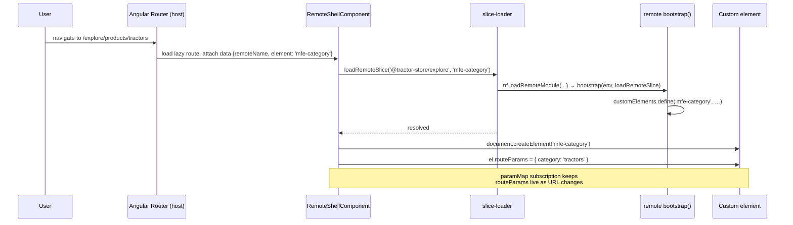

# Architecture

This doc explains the contract between the host and the remotes — what each
side owns, where the boundary sits, and how Native Federation makes runtime
composition possible.

## The two-layer model

Two layers, with a small, explicit contract between them.


The contract has exactly four touchpoints:

1. **`federation.manifest.json`** — the host's list of remote names → entry
   URLs, fetched at startup.
2. **`nav-contribution`** — a module each remote *exposes* that declares its
   base path and the intents it owns.
3. **`mfe-*` custom elements** — the actual UI fragments, also exposed via
   federation. The host instantiates these via `document.createElement`.
4. **`routeParams`** — a single object property the host writes onto a
   mounted custom element, carrying parsed path + query parameters.

Nothing else is shared at the boundary. There is no `import` from a remote in
host code, no Angular service crossing the line, no shared router state.

## Runtime discovery

The host bootstrap (`projects/host/src/main.ts:18-48`) is short and
deliberately manifest-driven:

```ts
window.__NF_REGISTRY__ = Object.freeze(createRegistry({...})());

Promise.all([
  fetch('./env.config.json').then((r) => r.json()),
  fetch('./federation.manifest.json').then((r) => r.json()),
]).then(async ([env, manifest]) => {
  const nf = await initFederation(manifest, {
    ...useShimImportMap({ shimMode: true }),
    hostRemoteEntry: './remoteEntry.json',
    /* … */
  });
  return import('./app/bootstrap').then((m) => m.bootstrap(nf, env, manifest));
});
```

Two artefacts drive everything:

- **`env.config.json`** — per-environment values: `apiUrl`, `cdnUrl`,
  `production`, `scope`. Same shape across all four apps. CI rewrites it for
  the deployed environment, so the same build works locally and on GitHub
  Pages.
- **`federation.manifest.json`** — the discovery file:

  ```json
  {
    "@tractor-store/explore":  "http://localhost:4201/remoteEntry.json",
    "@tractor-store/decide":   "http://localhost:4202/remoteEntry.json",
    "@tractor-store/checkout": "http://localhost:4203/remoteEntry.json"
  }
  ```

  Each value is the URL of a remote's `remoteEntry.json` — the import-map
  fragment Native Federation publishes during build. `initFederation` merges
  all of them into the page's import map so any subsequent
  `nf.loadRemoteModule(remoteName, exposedModule)` resolves to the right
  bundle.

The line `window.__NF_REGISTRY__ = …` sets up a tiny global event bus from
the federation orchestrator. It exists *before* Angular bootstraps, because
the very first thing remotes need is a place to publish/subscribe to (see
[navigation.md](./navigation.md)).

## Custom-element bridge

A remote does not ship Angular components for the host to import. It ships
**custom elements** (web components) registered under stable `mfe-*` tags via
`@angular/elements`.

A typical remote feature bootstrap
(`projects/explore/src/features/home/bootstrap.ts:1-17`):

```ts
const TAG = 'mfe-home';

export async function bootstrap(env, loadRemoteSlice) {
  const injector = await ensureSharedInjector(env, loadRemoteSlice);
  if (!customElements.get(TAG)) {
    customElements.define(TAG, createCustomElement(HomePage, { injector }));
  }
}
```

Two things matter here:

1. **Shared injector per remote.** `ensureSharedInjector`
   (`projects/explore/src/core/shared-injector.ts:1-27`) lazily creates one
   Angular `Injector` and reuses it for every feature in that remote. So when
   the host mounts `<mfe-home>` and `<mfe-header>` from the same remote,
   they share `HttpClient`, stores, and any other DI-provided services — but
   nothing leaks across remotes.
2. **Bootstrap is idempotent.** The `customElements.get` guard and the
   loader's per-tag `seen` map (`projects/host/src/app/loader/slice-loader.ts:38-73`)
   make it safe to request the same fragment from many places — only the
   first call defines the element.

### How a route activation lands a custom element on the page



The host component
(`projects/host/src/app/loader/remote-shell.component.ts:57-92`) follows
exactly this script: it reads `{ remoteName, element }` from the route data,
calls the loader, creates the element, and pipes `paramMap` + `queryParamMap`
into a single `routeParams` object. While the slice is loading it shows a
spinner; if the load fails it shows an error message.

#### Why `routeParams` and not attributes

HTMLElement reserves a long list of property names (`id`, `slot`, `title`,
`hidden`, `style`, …). If the host wrote each route param as its own
attribute or property it would silently collide with intrinsics — set
`<mfe-cart id="abc">` and Angular would happily read `''` because the DOM
already owns `id`. Instead, all params land under one well-known property
(`routeParams`), and the remote reads them through helpers in
`libs/navigation/src/lib/route-params.ts` (`param`, `requiredParam`,
`paramList`). Clean separation, zero collisions.

## Shared dependencies

Every app's `federation.config.mjs` uses the same pattern (host shown,
remotes mirror it):

```ts
shared: {
  ...shareAll(
    { singleton: true, strictVersion: true, requiredVersion: 'auto', build: 'package' },
    {
      overrides: {
        '@angular/core': { /* …same flags… */ includeSecondaries: { keepAll: true } },
      },
    },
  ),
},
sharedMappings: ["@internal/navigation", "@internal/ui", "@internal/logging"],
skip: ['rxjs/ajax', 'rxjs/fetch', 'rxjs/testing', 'rxjs/webSocket'],
```

What this means in practice:

- **`singleton: true` on Angular packages.** There is exactly one `@angular/core`
  in the page. Without this, two copies of Angular would each have their own
  `Zone`, their own injector tree roots, and DI would silently break across
  remotes. `strictVersion: true` makes a version mismatch fail loudly at
  load time instead of producing weird runtime bugs.
- **`includeSecondaries: { keepAll: true }` on `@angular/core`.** Keeps
  secondary entry points (`@angular/core/rxjs-interop`, etc.) in the shared
  bundle so remotes can use them without re-bundling them.
- **`sharedMappings`** for the three internal libraries
  (`@internal/navigation`, `@internal/ui`, `@internal/logging`). These are
  TypeScript path-mapped libraries inside this workspace; sharing them means
  the host and all remotes use the same `NavLinkDirective`, `Spinner`, etc.,
  and `instanceof` checks work across the boundary.
- **`skip`** trims rxjs sub-entries that aren't actually used at runtime,
  cutting the shared bundle.

Per-remote configs (`projects/explore/federation.config.mjs:5-15`,
`projects/decide/federation.config.mjs:5-9`,
`projects/checkout/federation.config.mjs:5-13`) add an `exposes` map that
lists the `mfe-*` modules and the `nav-contribution`. The host config has no
`exposes` — it only consumes.

## Team boundary visualisation

Each team has a colour:

| Team     | Hex       | Owns                        |
| -------- | --------- | --------------------------- |
| Explore  | `#FF5A54` | catalog, header, footer     |
| Decide   | `#53FF90` | product detail              |
| Checkout | `#FFDE54` | cart, checkout, mini-cart   |

The CDN ships a small overlay script (`public/cdn/js/helper.js`, loaded by
the host in `projects/host/src/app/bootstrap.ts:24-28`). It looks for
`data-boundary` and `data-boundary-page` attributes on rendered DOM and, when
`html.showBoundaries` is set, draws coloured boxes around each team's
contribution. It's a debugging aid — useful when you want to see at a glance
which team owns which pixel — and the only enforcement of team boundaries is
the federation config itself: a remote that wants something not in the
shared/sharedMappings list cannot accidentally import it from another remote.

## See also

- [Navigation](./navigation.md) — how the intent system makes the boundary
  navigable without coupling.
- [Features](./features.md) — concrete catalogue of what each remote ships.
