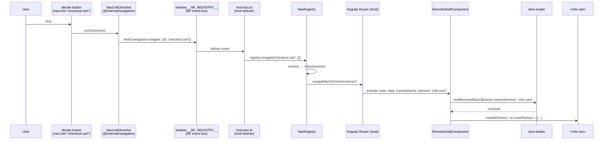
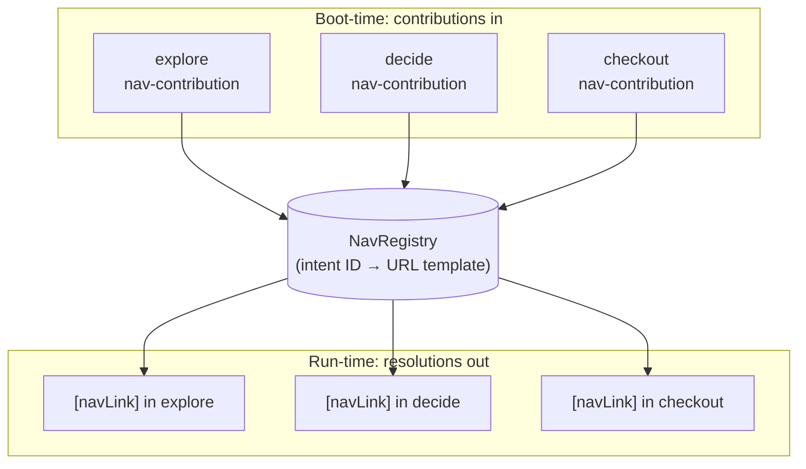

# Navigation

The Tractor Store has *one* router (in the host) and *zero* hard-coded URLs
in the remotes. A click in `decide` that needs to land on the cart never
mentions `/checkout/cart` — it emits the **intent** `checkout.cart` and lets
the host figure out the URL. This doc walks through how that works and why
it's the load-bearing piece of the host/remote decoupling.

## The problem with the obvious solution

In a naïve micro-frontend setup, remote A linking to remote B picks one of
two bad options:

- **Hard-code the URL.** Now A breaks every time B reorganises its routes,
  and an `/checkout` rename becomes a coordinated multi-team migration.
- **Import B's routing module.** Now A and B are build-time coupled, share a
  router instance, and can't deploy independently.

Both options leak B's URL scheme into A. The intent system removes the leak
entirely.

## The contract: `nav-contribution`

Each remote *exposes* (via `federation.config.mjs`) a `nav-contribution`
module. It's a single object describing what the remote routes:

```ts
// projects/explore/src/core/nav-contribution.ts
export const navContribution: NavContribution = {
  source: '@tractor-store/explore',
  basePath: 'explore',
  intents: [
    { id: 'explore.home',              path: '/',                    element: 'mfe-home' },
    { id: 'explore.products',          path: '/products',            element: 'mfe-category' },
    { id: 'explore.products.category', path: '/products/:category',  element: 'mfe-category' },
    { id: 'explore.stores',            path: '/stores',              element: 'mfe-stores' },
  ],
};
```

The shape (`libs/navigation/src/lib/nav-types.ts:17-30`):

- `source` — the federation remote name.
- `basePath` — the URL prefix the host will mount the remote under
  (`/explore`, `/decide`, `/checkout`).
- `intents[]` — every routable destination the remote owns:
  - `id` — the public name. Other remotes link to *this* string, never to a URL.
  - `path` — the path *inside* `basePath`, with optional `:param` segments.
  - `element` — the `mfe-*` custom element to render at that path.

The intent ID is the only thing that crosses team boundaries. URLs and
element tags are an implementation detail of the owning team.

## Boot-time wiring

When the host starts, it loads every remote's `nav-contribution` in parallel
and uses them to build its router config and a *registry* of intents.

The orchestration (`projects/host/src/app/nav/setup-shell-nav.ts:51-91`) is
small enough to read in full:

```ts
export const setupShellNavigation = async (deps): Promise<void> => {
  deps.onNavigate(async ({ id, payload }) => {
    try { await deps.registry.navigate(id, payload); }
    catch (err) { console.error(`[nav] navigation:navigate failed for "${id}"`, err); }
  });
  deps.onRoute(async ({ url }) => {
    try { await deps.router.navigateByUrl(url); }
    catch (err) { console.error(`[nav] navigation:route failed for "${url}"`, err); }
  });

  const loaded = await loadContributions(deps.nf, deps.manifest);
  for (const { contribution } of loaded) deps.registry.register(contribution);

  deps.router.resetConfig([
    ...buildRemoteRoutes(loaded),
    { path: '**', redirectTo: deps.fallbackRedirect ?? 'explore' },
  ]);

  await deps.publishRegistry(deps.registry);
};
```

It does four things:

1. Subscribes to `navigation:navigate` and `navigation:route` events on the
   bus — these are how remotes ask the host to go somewhere.
2. Calls `loadContributions` to fetch every remote's nav module
   (`projects/host/src/app/nav/load-contributions.ts:41-63`, using
   `Promise.allSettled` so a broken remote doesn't break the whole shell).
3. Resets the Angular Router config with one route per intent. Every route
   lazy-loads the same `RemoteShellComponent`; only the route data differs:

   ```ts
   // projects/host/src/app/nav/remote-routes.ts:32-37
   routes.push({
     path: toRoutePath(contribution.basePath, intent.path),
     loadComponent: loadRemoteShell,
     data: { remoteName, element: intent.element },
   });
   ```

4. Publishes the populated registry on the bus
   (`__NF_REGISTRY__.register('navigation:registry', registry)`), which wakes
   up every `[navLink]` directive that was waiting for it.

The DI adapter is in `projects/host/src/app/nav/provide-nav.ts:21-44`. It
runs the orchestration above as an `appInitializer`, so by the time the user
sees the first frame the registry is populated and routing is wired.

## How a remote links somewhere: `[navLink]`

Remotes never type a URL and never inject `Router`. They use a directive
shipped from `@internal/navigation`:

```html
<a [navLink]="'checkout.cart'">Cart</a>
<button [navLink]="'decide.product'" [navParams]="{ id: product.id }">
  See details
</button>
```

The directive (`libs/navigation/src/lib/nav-link.directive.ts:9-50`):

- Subscribes to `onRegistryReady` on the bus.
- Until the registry is published, hides itself (`[hidden]="!available()"`)
  and reports `aria-disabled="true"`.
- Once available, computes `href` via `registry.resolve(intent, params)` so
  the link is a real anchor with a real URL — middle-click, copy-link, and
  screen readers all work.
- On click, intercepts the navigation and emits
  `navigation:navigate` on the bus instead of letting the browser navigate —
  so the route change goes through Angular's Router, not a full reload.

The host listens for that event and asks the registry to resolve and
navigate. The registry (`projects/host/src/app/nav/nav-registry.ts:37-58`)
substitutes path params, peels off the rest as query string, and hands a URL
to `Router.navigateByUrl`.

## Reading params on the receiving end

Once the host's route activates, `RemoteShellComponent` mounts the right
custom element and writes a `routeParams` object onto it. The remote
component reads that object through Angular's component-input binding — no
DI needed:

```ts
// projects/decide/src/features/product/product.page.ts:38-41
readonly routeParams = input<RouteParams>({});

readonly id  = computed(() => param(this.routeParams(), 'id'));
readonly sku = computed(() => param(this.routeParams(), 'sku'));
```

`param`, `requiredParam`, and `paramList` are tiny helpers from
`libs/navigation/src/lib/route-params.ts`. They handle the
single-value-vs-array shape (multi-value query params come through as arrays)
and throw helpful errors for missing required params.

## End-to-end: a click in `decide` becomes a URL change



Notice what *isn't* in the diagram: no import from `decide` to `checkout`,
no shared `Router` instance, no string `'/checkout/cart'` typed anywhere
inside `decide`'s code. The only thing crossing the boundary is the literal
`'checkout.cart'`.

## The registry as a hub

Conceptually the system is one big star:



Contributions flow into the registry once, at startup. Once it's published
on the shared bus (`navigation:registry`), every `[navLink]` directive in
every remote sees the same picture: the union of every team's intents.

## Why this is cool

Several payoffs fall out of the design:

- **Independent deploys.** A team can rename `/checkout/cart` to `/cart` by
  editing one path in their own `nav-contribution.ts`. No other remote
  needs to know — `checkout.cart` still resolves, just to a different URL.
- **No router import in remotes.** Remotes don't depend on `@angular/router`
  for navigation. The directive ships in a small shared library; the actual
  Router lives only in the host.
- **The host owns zero remote-specific knowledge.** It iterates over the
  contributions it loaded and builds routes generically — there is no
  `if (remoteName === 'checkout')` anywhere in the host code.
- **Testable in isolation.** Each remote runs standalone on its own port
  with the same `federation.manifest.json`. When `decide` boots on `:4202`
  it loads `mfe-header` from `:4201` (explore) and `mfe-add-to-cart` from
  `:4203` (checkout) just like the host would. See the cross-remote loads
  in `projects/decide/src/features/product/product.page.ts:32-35`.
- **Graceful degradation.** A `[navLink]` to an unknown intent stays hidden
  with `aria-disabled="true"` instead of producing a broken URL — so a
  half-deployed system fails *visibly* rather than silently.
- **Standards-friendly.** All cross-app messaging goes through one tiny
  global (`window.__NF_REGISTRY__`). No framework lock-in beyond Angular's
  `[navLink]` directive, which is itself only ~50 lines.

The intent system is what turns "three Angular apps loaded into one page"
into "three independently-evolving products that happen to share a shell".

## See also

- [Architecture](./architecture.md) — the runtime and custom-element
  bridge that the navigation layer rides on top of.
- [Features](./features.md) — the full list of intents per team.
